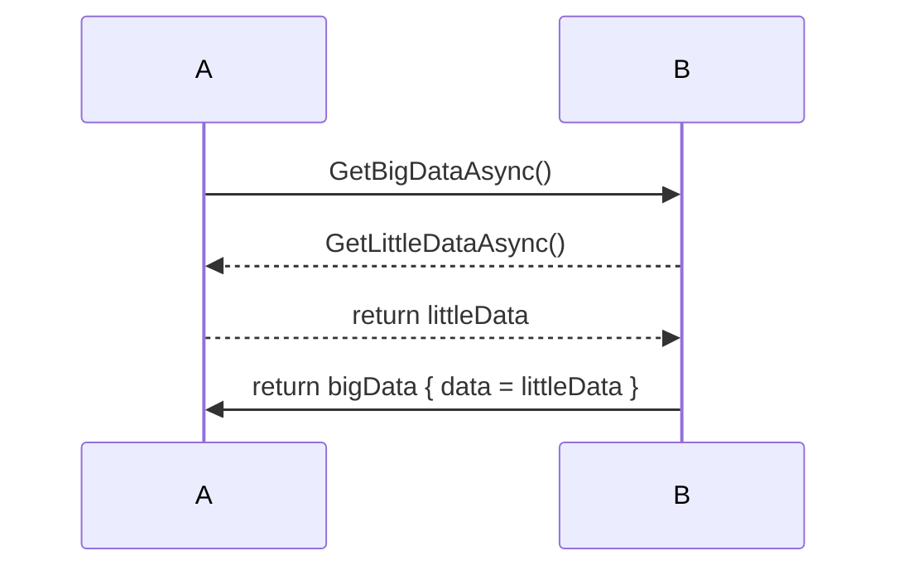

# Integration with the `JoinableTaskFactory`

StreamJsonRpc can help mitigate deadlocks that may occur when a JSON-RPC client blocks the main thread of an application during an outbound RPC call and the RPC server requires the main thread in order to complete the operation through integrating with the application's `JoinableTaskFactory`.

[Learn more about `JoinableTaskFactory` and how it can mitigate deadlocks for your application](https://aakaka.ms/vsthreading).
_This_ topic will focus on the JSON-RPC aspects of deadlock mitigation.

## Problem statement

Let's start by examining the problem to be solved.

### An RPC client and server in the same process.

The simplest example involves use of JSON-RPC between a client and server that live in the same process.
This process has a main thread, and the server needs the main thread to satisfy some RPC requests.
If the client *blocks* the main thread while waiting on a response from the RPC server, a deadlock may result.

The `JoinableTaskFactory` is generally designed to mitigate deadlocks where code calls async code that requires the main thread but must block the main thread till the work is complete.
But when async RPC is involved, the `JoinableTaskFactory` cannot typically resolve the deadlock without help because it cannot see the causal relationship between the RPC client and server.
In particular, StreamJsonRpc implements the JSON-RPC server with a read loop, which dispatches incoming requests onto the thread pool (or some specified `SynchronizationContext`) in a way that the `JoinableTaskFactory` cannot track back to the RPC request, which merely placed work in the RPC system's private queue.

### Adding an intemediate process in the mix

Consider a process that does not itself have a main thread and no need for the `JoinableTaskFactory`, but finds itself as an intermediary in the following complex RPC scenario:



In the above sequence, process **A** has a main thread and service process **B** does not.
But **B** picks up a main thread dependency for certain requests because to fulfill them, it must send its own RPC request back to **A**, which needs the main thread to construct the response.

This may work fine, until **A** decides it must block the main thread while waiting for **B** to respond.
This creates a deadlock because when **B**'s request comes into the **A** process when there is no way for **A** to determine that satisfying **B**'s request is necessary for **A** to get what it ultimately wants.

## The solution

StreamJsonRpc 2.15.14-alpha introduced the `joinableTaskToken` top-level property that allows the causal relationship between an outbound request and an inbound one to be detected.
This can be used to mitigate the deadlocks described above.

This property can propagate across any number of processes in order to mitigate deadlocks if a loop exists.
In fact multiple processes with their own main threads can contribute to the token so that any of these processes that get called back as part of the request they themselves made, they will recognize the causal relationship and can mitigate deadlocks.

### Processes with a main thread

To resolve the deadlock, we need to follow the 3rd of [the threading rules of the `JoinableTaskFactory`](https://github.com/microsoft/vs-threading/blob/main/doc/threading_rules.md) by carefully applying `JoinableTaskFactory.RunAsync` such that the causal relationship is observed by the `JoinableTaskFactory` so it can mitigate the deadlocks.

An application that has a main thread and an instance of `JoinableTaskContext` should set the `JsonRpc.JoinableTaskFactory` property to an instance of `JoinableTaskFactory`.
Doing this has the following effects:

1. An outbound JSON-RPC request that occurs within the context of a `JoinableTask` will include `joinableTaskToken` as a top-level property in the JSON-RPC message.
  This property carries a token that represents the `JoinableTask` that needs the RPC call to complete.
2. When an inbound JSON-RPC request carries a `joinableTaskToken` top-level property, the request will be dispatched within a `JoinableTask` that was created based on the token provided in the message.

Taken together, these two effects ensure that when an RPC call requires the main thread to fulfill, and the RPC client is blocking the main thread, that the `JoinableTaskFactory` will be able to mitigate deadlocks by allowing the RPC server to access the main thread that is owned by the RPC client, assuming both parties are following the [`JoinableTaskFactory` threading rules](https://github.com/microsoft/vs-threading/blob/main/doc/threading_rules.md).

This holds even when one or more intermediate processes exist between the client and server, provided each process propagates the `joinableTaskToken` top-level property.

### Processes without a main thread

Considering the more complex scenario in the above problem statement, there may be an intermediary process in a multi-hop RPC chain that itself doesn't have a main thread and thus no need for a `JoinableTaskFactory`.

StreamJsonRpc makes accommodation for this scenario by automatically propagating the `joinableTaskToken` top-level property it sees in inbound requests to all outbound requests that come from that request.
In other words, StreamJsonRpc considers that all outbound RPC requests are causally related to the inbound RPC request that caused the outbound request to be made.

This does _not_ mean that any and all requests that are running concurrently with an outbound RPC request will be seen as causally related.
Only the outbound requests that derive from the .NET execution context that dispatched an incoming request will be assigned that request's `joinableTaskToken`.

## The protocol

This protocol spec uses capitalized words as specified in [RFC 2119](https://www.rfc-editor.org/rfc/rfc2119).

### The JSON-RPC request message

The new `joinableTaskToken` property MAY be included in JSON-RPC *request* messages.
For example:

```json
{
    "jsonrpc": "2.0",
    "id": 1,
    "method": "someMethod",
    "params": [],
    "joinableTaskToken": "some-token"
}
```

Because only request messages involve the sender waiting on a response from the server, this new property SHOULD NOT be included in notifications, result or error messages.

### The JSON-RPC client

A client that supports the `joinableTaskToken` MAY include or omit this property for any particular outbound message.

A client SHOULD include the property in an outbound request when the client may block its main thread while waiting on the result of the operation.

A client MUST include the property in an outbound request when the request was created as a part of fulfilling an inbound request that carried this property.
The outbound property MUST carry at least the content of the inbound property's value that describes the contributions from other processes.

### The JSON-RPC server

A server MUST store the value of the `joinableTaskToken` property in a location such that it may be included in outbound requests that occur as a consequence of servicing this inbound request.

A server with a main thread SHOULD apply the token to the context of the dispatched method such that if the token applies to this process, main thread contention can be resolved rather than deadlock.

### The token's value

The token is created and consumed by the `JoinableTask` APIs and is an implementation detail of that library that fulfills these requirements:

- The token represents the aggregate interests of all processes and main threads involved in the RPC call chain.
- A corrupted token MUST NOT have any impact on functionality other than the inability to mitigate deadlocks.
  A corrupted token MAY be logged or discarded.
- A missing token MUST NOT lead to any malfunction other than the inability to mitigate deadlocks.
- A token SHOULD NOT disclose any confidential data.
